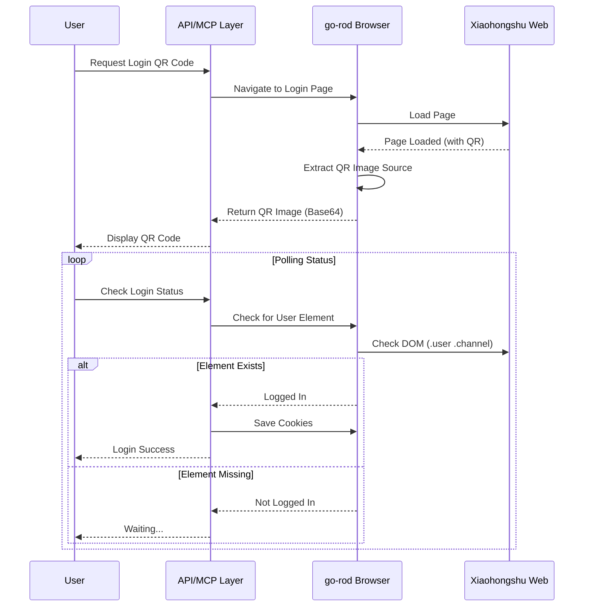
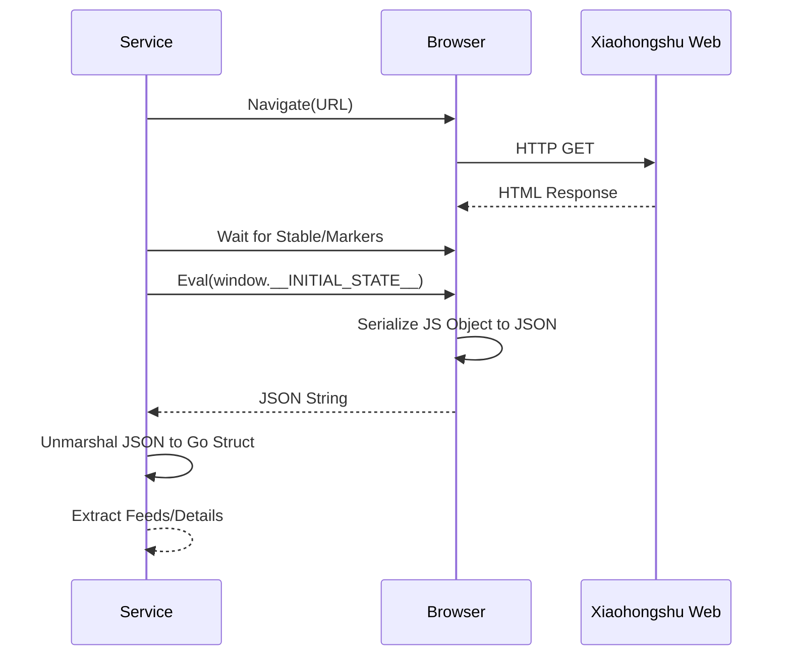
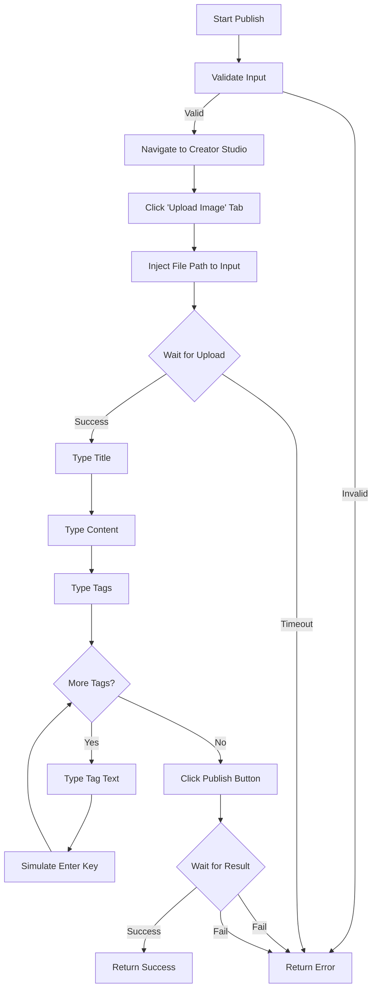

# 小红书 MCP Server 开发指南

本文档旨在为开发者提供一份详尽的指南，帮助理解、运行和开发 `xiaohongshu-mcp` 项目。

## 1. 项目概览

**`xiaohongshu-mcp`** 是一个 Model Context Protocol (MCP) 服务器，旨在让 AI 智能体（如 Claude, Cursor 等）能够与小红书平台进行交互。它充当了 AI 与小红书网页版之间的桥梁。

### 架构设计

本项目采用分层架构设计：

1.  **MCP 层** (`mcp_server.go`):
    *   基于 `github.com/modelcontextprotocol/go-sdk` 实现 MCP 协议。
    *   定义并注册暴露给 AI 客户端的工具（如 `search_feeds` 搜索笔记, `publish_content` 发布内容）。
    *   处理参数校验及 Panic 恢复机制。

2.  **HTTP 层** (`app_server.go`, `routes.go`, `handlers_api.go`):
    *   使用 `Gin` 框架提供 MCP 端点服务 (SSE/Streamable)。
    *   同时提供标准的 REST API 接口 (`/api/v1/...`)，便于在没有 MCP 客户端的情况下直接调用或调试。

3.  **服务层** (`service.go`):
    *   编排业务逻辑。
    *   管理浏览器实例和上下文生命周期。
    *   连接 API/MCP 层与底层的浏览器自动化层。

4.  **自动化层** (`xiaohongshu/` 包):
    *   使用 `go-rod` 实现无头浏览器自动化。
    *   处理与小红书网页版的直接交互（点击、输入、导航）。
    *   **核心策略**: 相比于解析复杂的 HTML DOM，本项目主要通过提取页面源码中的 `window.__INITIAL_STATE__` JavaScript 对象来获取稳定、结构化的 JSON 数据。

### 架构图

```mermaid
graph TD
    User[User / AI Agent] <-->|MCP Protocol| MCPServer[MCP Server Layer]
    User <-->|HTTP API| HTTPServer[HTTP Server Layer]
    
    subgraph "Xiaohongshu MCP Server"
        MCPServer --> Service[Service Layer]
        HTTPServer --> Service
        
        Service -->|Controls| Browser[Browser Automation Layer (go-rod)]
        
        subgraph "Automation Modules"
            Browser --> Login[Login & Cookies]
            Browser --> Search[Search & Feeds]
            Browser --> Publish[Publish Content]
            Browser --> Interact[Like & Comment]
        end
    end
    
    Browser <-->|CDP / Actions| XHS[Xiaohongshu Web]
```

## 2. 安装与使用

### 前置要求
*   **Go**: 1.24 或更高版本。
*   **Chrome/Chromium**: 服务器需要浏览器可执行文件来执行自动化操作。

### 安装步骤
```bash
# 克隆仓库
git clone https://github.com/xpzouying/xiaohongshu-mcp.git
cd xiaohongshu-mcp

# 下载依赖
go mod download
```

### 运行服务器

你可以直接运行项目：

```bash
go run .
```

**命令行参数:**
*   `-headless`: 是否以无头模式运行浏览器 (默认: `true`)。调试时可设置为 `false` 以观察浏览器行为。
    ```bash
    go run . -headless=false
    ```
*   `-bin`: 指定浏览器可执行文件的路径 (可选)。
*   `-port`: 服务器端口 (默认: `:18060`)。

### 运行效果示例


*MCP Inspector 调试界面*

### 环境变量
*   `ROD_BROWSER_BIN`: 另一种指定浏览器路径的方式。

## 3. 代码核心解析

### 核心组件

*   **`main.go`**: 程序入口。负责解析参数、初始化配置、创建 `XiaohongshuService` 并启动 `AppServer`。
*   **`app_server.go`**: 初始化 HTTP 服务器和 MCP 服务器，持有所有主要组件的引用。
*   **`mcp_server.go`**:
    *   `InitMCPServer`: 创建 MCP 服务器实例。
    *   `registerTools`: 注册所有可用工具。**如果你要添加新功能，请在这里注册。**
    *   `withPanicRecovery`: 一个中间件包装器，确保单个工具的崩溃不会导致整个服务器停止运行。
*   **`service.go`**: 包含 `XiaohongshuService` 结构体。这里的方法（如 `PublishContent`, `SearchFeeds`）与 MCP 工具一一对应，负责处理业务逻辑（如输入验证）并调用具体的自动化操作。

### 浏览器自动化模块 (`xiaohongshu/` 包)

该包包含与网站交互的底层逻辑。

#### 登录模块 (`login.go`)
*   **状态检测**: 通过检查特定的 DOM 元素 (`.user .link-wrapper .channel`) 来判断是否已登录。
*   **二维码**: 能够提取登录二维码图片的源地址，供用户扫码。
*   **Cookies**: 使用 `cookies/` 包保存和加载会话 Cookie，实现持久化登录。

**登录流程图**



#### 数据获取策略
对于 `search.go` (搜索), `feeds.go` (列表), `user_profile.go` (用户主页), 和 `feed_detail.go` (详情) 等模块，项目使用了一种稳健的模式：
1.  **导航**: 跳转到目标 URL（如搜索结果页）。
2.  **等待**: 等待页面加载稳定或特定标记出现。
3.  **提取**: 在浏览器中执行 JavaScript 以获取 `window.__INITIAL_STATE__`。
    ```go
    // search.go 示例
    result := page.MustEval(`() => {
        return JSON.stringify(window.__INITIAL_STATE__.search.feeds);
    }`).String()
    ```
4.  **解析**: 将 JSON 字符串反序列化为 Go 结构体。

这种方法比尝试抓取经常变化的 CSS 类名要稳定得多。

**数据获取时序图**



#### 内容发布 (`publish.go`, `publish_video.go`)
*   **导航**: 跳转到创作者中心 URL。
*   **文件上传**:
    *   定位文件输入元素（通常是隐藏的）。
    *   使用 `MustSetFiles` 注入文件路径。
    *   等待上传完成（通过检查预览元素或按钮状态）。
*   **内容填写**:
    *   使用 `go-rod` 的输入模拟功能填写标题和正文。
    *   **标签处理**: 特殊处理标签输入，通过模拟 "Enter" 键来确认下拉菜单中的标签建议。

**发布流程图**



#### 草稿箱保存 (`publish.go`)
*   **复用流程**: 复用发布内容的上传和填写流程。
*   **差异点**: 最后一步查找并点击 "暂存离开" 按钮，而不是 "发布" 按钮。
*   **按钮查找**: 使用文本匹配 ("暂存离开") 来定位按钮，提高了对页面结构变化的适应性。

#### 交互操作 (`like_favorite.go`, `comment_feed.go`)
*   **选择器**: 定义交互按钮（点赞、收藏）的 CSS 选择器。
*   **逻辑**:
    *   首先检查当前状态（是否已点赞？）。
    *   如果需要操作，则点击按钮。
    *   短暂延迟后验证新状态，确保操作成功。

### 运行结果示例

#### 搜索结果


#### 发布结果


## 4. 如何添加新功能

假设你要添加一个“关注用户”的功能：

1.  **实现自动化**: 创建 `xiaohongshu/follow.go`。实现 `FollowAction` 结构体，包含导航到用户主页并点击“关注”按钮的方法。
2.  **更新服务**: 在 `service.go` 的 `XiaohongshuService` 中添加 `FollowUser` 方法。该方法应实例化 `FollowAction` 并调用它。
3.  **注册工具**: 在 `mcp_server.go` 的 `registerTools` 中添加一个新的工具定义 `follow_user`，并连接到 `FollowUser` 服务方法。
4.  **添加 API 接口 (可选)**: 如果需要，在 `handlers_api.go` 和 `routes.go` 中添加对应的 REST 接口。

## 5. 常见问题与调试

*   **登录失败**: 检查二维码选择器是否已更改。使用 `-headless=false` 运行以手动扫码并验证。
*   **找不到选择器**: 小红书经常更新类名（通常是混淆过的，如 `css-12345`）。尽量使用稳定的属性、结构化选择器（如 `nth-child`）或 `__INITIAL_STATE__`。
*   **超时**: 对于涉及大文件上传的操作，请增加 `rod.Page.Timeout()` 的超时时间。
